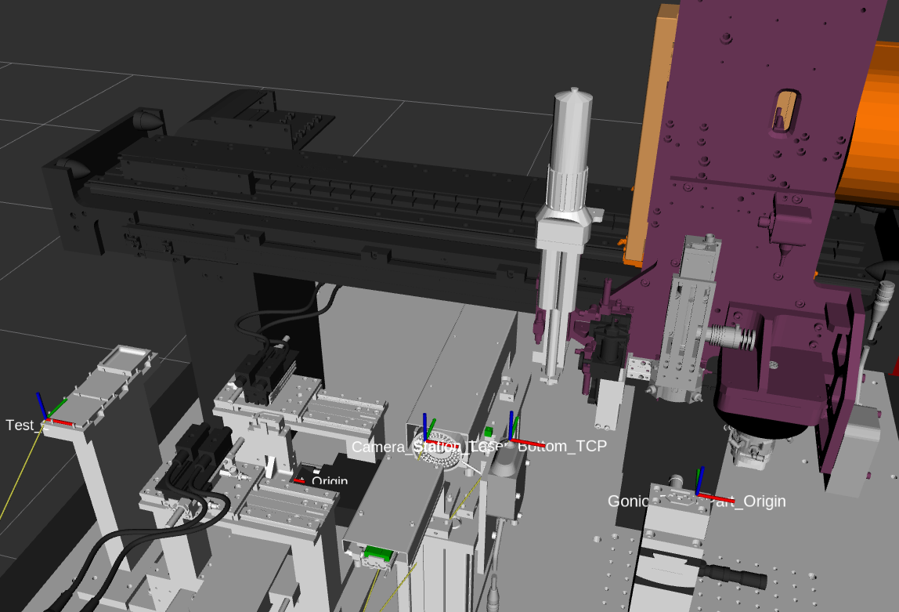
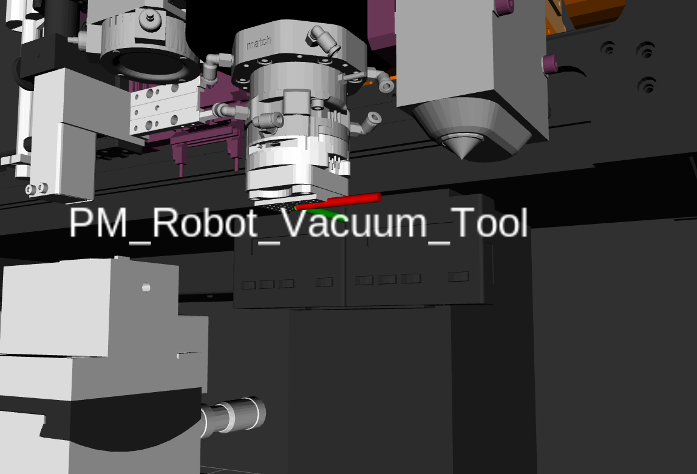
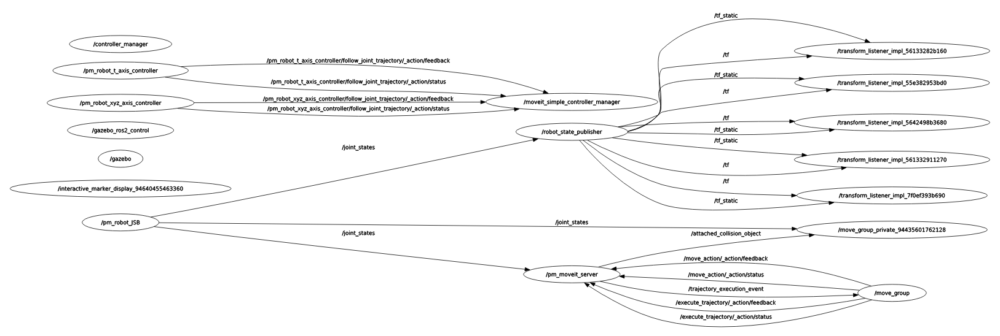
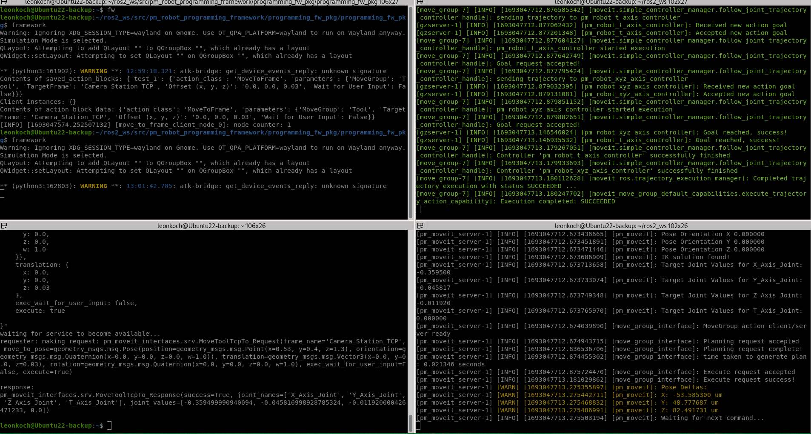
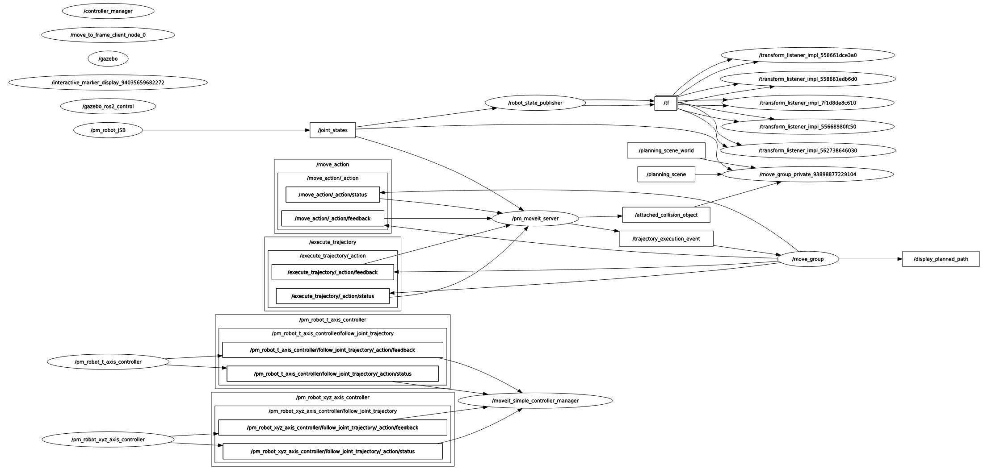

Der Mistfehler: [pm_moveit_server-1] [WARN] [1694184888.904419982] [moveit_ros.current_state_monitor]: No state update received within 100ms of system clock
[pm_moveit_server-1] [WARN] [1694184889.905730837] [moveit_ros.current_state_monitor]: No state update received within 100ms of system clock
[pm_moveit_server-1] [WARN] [1694184890.907024580] [moveit_ros.current_state_monitor]: No state update received within 100ms of system clock
[pm_moveit_server-1] [WARN] [1694184891.908258818] [moveit_ros.current_state_monitor]: No state update received within 100ms of system clock

## ros2 node list

leonkoch@Ubuntu22-backup:~/ros2_ws/src/ros2_pm_robot_control$ ros2 node list
/controller_manager
/gazebo
/gazebo_ros2_control
/interactive_marker_display_94640455463360
/move_group
/move_group_private_94435601762128
/moveit_simple_controller_manager
/pm_moveit_server
/pm_robot_JSB
/pm_robot_t_axis_controller
/pm_robot_xyz_axis_controller
/robot_state_publisher
/rviz2
/rviz2_private_139702142602368
/transform_listener_impl_55e382953bd0
/transform_listener_impl_56133282b160
/transform_listener_impl_561332911270
/transform_listener_impl_5642498b3680
/transform_listener_impl_7f0ef393b690

# Fehlt da nicht pm_robot_control_test?

## ros2 service list

leonkoch@Ubuntu22-backup:~/ros2_ws/src/ros2_pm_robot_control$ ros2 service list
/apply_joint_effort
/apply_link_wrench
/apply_planning_scene
/check_state_validity
/clear_joint_efforts
/clear_link_wrenches
/clear_octomap
/compute_cartesian_path
/compute_fk
/compute_ik
/controller_manager/configure_controller
/controller_manager/describe_parameters
/controller_manager/get_parameter_types
/controller_manager/get_parameters
/controller_manager/list_controller_types
/controller_manager/list_controllers
/controller_manager/list_hardware_components
/controller_manager/list_hardware_interfaces
/controller_manager/list_parameters
/controller_manager/load_controller
/controller_manager/reload_controller_libraries
/controller_manager/set_hardware_component_state
/controller_manager/set_parameters
/controller_manager/set_parameters_atomically
/controller_manager/switch_controller
/controller_manager/unload_controller
/delete_entity
/gazebo/describe_parameters
/gazebo/get_parameter_types
/gazebo/get_parameters
/gazebo/list_parameters
/gazebo/set_parameters
/gazebo/set_parameters_atomically
/gazebo_ros2_control/describe_parameters
/gazebo_ros2_control/get_parameter_types
/gazebo_ros2_control/get_parameters
/gazebo_ros2_control/list_parameters
/gazebo_ros2_control/set_parameters
/gazebo_ros2_control/set_parameters_atomically
/get_model_list
/get_planner_params
/get_planning_scene
/interactive_marker_display_94640455463360/describe_parameters
/interactive_marker_display_94640455463360/get_parameter_types
/interactive_marker_display_94640455463360/get_parameters
/interactive_marker_display_94640455463360/list_parameters
/interactive_marker_display_94640455463360/set_parameters
/interactive_marker_display_94640455463360/set_parameters_atomically
/load_map
/move_group/describe_parameters
/move_group/get_parameter_types
/move_group/get_parameters
/move_group/list_parameters
/move_group/set_parameters
/move_group/set_parameters_atomically
/move_group_private_94435601762128/describe_parameters
/move_group_private_94435601762128/get_parameter_types
/move_group_private_94435601762128/get_parameters
/move_group_private_94435601762128/list_parameters
/move_group_private_94435601762128/set_parameters
/move_group_private_94435601762128/set_parameters_atomically
/moveit_simple_controller_manager/describe_parameters
/moveit_simple_controller_manager/get_parameter_types
/moveit_simple_controller_manager/get_parameters
/moveit_simple_controller_manager/list_parameters
/moveit_simple_controller_manager/set_parameters
/moveit_simple_controller_manager/set_parameters_atomically
/pause_physics
/plan_kinematic_path
/pm_moveit_server/describe_parameters
/pm_moveit_server/execute_plan
/pm_moveit_server/get_parameter_types
/pm_moveit_server/get_parameters
/pm_moveit_server/list_parameters
/pm_moveit_server/move_cam1_to_frame
/pm_moveit_server/move_laser_to_frame
/pm_moveit_server/move_tool_to_frame
/pm_moveit_server/set_parameters
/pm_moveit_server/set_parameters_atomically
/pm_robot_JSB/describe_parameters
/pm_robot_JSB/get_parameter_types
/pm_robot_JSB/get_parameters
/pm_robot_JSB/list_parameters
/pm_robot_JSB/set_parameters
/pm_robot_JSB/set_parameters_atomically
/pm_robot_t_axis_controller/describe_parameters
/pm_robot_t_axis_controller/get_parameter_types
/pm_robot_t_axis_controller/get_parameters
/pm_robot_t_axis_controller/list_parameters
/pm_robot_t_axis_controller/query_state
/pm_robot_t_axis_controller/set_parameters
/pm_robot_t_axis_controller/set_parameters_atomically
/pm_robot_xyz_axis_controller/describe_parameters
/pm_robot_xyz_axis_controller/get_parameter_types
/pm_robot_xyz_axis_controller/get_parameters
/pm_robot_xyz_axis_controller/list_parameters
/pm_robot_xyz_axis_controller/query_state
/pm_robot_xyz_axis_controller/set_parameters
/pm_robot_xyz_axis_controller/set_parameters_atomically
/query_planner_interface
/reset_simulation
/reset_world
/robot_state_publisher/describe_parameters
/robot_state_publisher/get_parameter_types
/robot_state_publisher/get_parameters
/robot_state_publisher/list_parameters
/robot_state_publisher/set_parameters
/robot_state_publisher/set_parameters_atomically
/rviz2/describe_parameters
/rviz2/get_parameter_types
/rviz2/get_parameters
/rviz2/list_parameters
/rviz2/set_parameters
/rviz2/set_parameters_atomically
/rviz2_private_139702142602368/describe_parameters
/rviz2_private_139702142602368/get_parameter_types
/rviz2_private_139702142602368/get_parameters
/rviz2_private_139702142602368/list_parameters
/rviz2_private_139702142602368/set_parameters
/rviz2_private_139702142602368/set_parameters_atomically
/rviz_moveit_motion_planning_display/robot_interaction_interactive_marker_topic/get_interactive_markers
/save_map
/set_planner_params
/spawn_entity
/unpause_physics

# ros2 topic list

leonkoch@Ubuntu22-backup:~/ros2_ws/src/ros2_pm_robot_control$ ros2 topic list
/attached_collision_object
/clock
/collision_object
/display_contacts
/display_planned_path
/dynamic_joint_states
/joint_states
/monitored_planning_scene
/motion_plan_request
/parameter_events
/performance_metrics
/planning_scene
/planning_scene_world
/pm_robot_JSB/transition_event
/pm_robot_t_axis_controller/controller_state
/pm_robot_t_axis_controller/joint_trajectory
/pm_robot_t_axis_controller/state
/pm_robot_t_axis_controller/transition_event
/pm_robot_xyz_axis_controller/controller_state
/pm_robot_xyz_axis_controller/joint_trajectory
/pm_robot_xyz_axis_controller/state
/pm_robot_xyz_axis_controller/transition_event
/recognized_object_array
/robot_description
/robot_description_semantic
/rosout
/rviz_moveit_motion_planning_display/robot_interaction_interactive_marker_topic/feedback
/rviz_moveit_motion_planning_display/robot_interaction_interactive_marker_topic/update
/tf
/tf_static
/trajectory_execution_event

## ros2 action list

leonkoch@Ubuntu22-backup:~/ros2_ws/src/ros2_pm_robot_control$ ros2 action list
/execute_trajectory
/move_action
/pm_robot_t_axis_controller/follow_joint_trajectory
/pm_robot_xyz_axis_controller/follow_joint_trajectory

## ros2 control list_controllers

leonkoch@Ubuntu22-backup:~/ros2_ws/src/ros2_pm_robot_control$ ros2 control list_controllers
pm_robot_JSB        [joint_state_broadcaster/JointStateBroadcaster] active    
pm_robot_xyz_axis_controller[joint_trajectory_controller/JointTrajectoryController] active    
pm_robot_t_axis_controller[joint_trajectory_controller/JointTrajectoryController] active    

## Normaler service call über terminal: 

## Selber Call über mein Framework

sim sieht alle gleich aus

server:
so mit service call über das Terminal:

leonkoch@Ubuntu22-backup:~$ ros2 service call /pm_moveit_server/move_tool_to_frame pm_moveit_interfaces/srv/MoveToolTcpTo "{frame_name: 'Camera_Station_TCP', translation: {x: 0.0, y: 0.0, z: 0.015}, execute: true }"
waiting for service to become available...
requester: making request: pm_moveit_interfaces.srv.MoveToolTcpTo_Request(frame_name='Camera_Station_TCP', move_to_pose=geometry_msgs.msg.Pose(position=geometry_msgs.msg.Point(x=0.0, y=0.0, z=0.0), orientation=geometry_msgs.msg.Quaternion(x=0.0, y=0.0, z=0.0, w=1.0)), translation=geometry_msgs.msg.Vector3(x=0.0, y=0.0, z=0.015), rotation=geometry_msgs.msg.Quaternion(x=0.0, y=0.0, z=0.0, w=1.0), exec_wait_for_user_input=False, execute=True)

response:
pm_moveit_interfaces.srv.MoveToolTcpTo_Response(success=True, joint_names=['X_Axis_Joint', 'Y_Axis_Joint', 'Z_Axis_Joint', 'T_Axis_Joint'], joint_values=[-8.000490925041959e-05, 1.7898623809742276e-06, -0.03596193715929985, 0.00032045997795648873])

[pm_moveit_server-1] [INFO] [1693048585.140929825] [pm_moveit]: Endeffector Link: PM_Robot_Tool_TCP
[pm_moveit_server-1] [INFO] [1693048585.141040315] [pm_moveit]: Model frame: world
[pm_moveit_server-1] [INFO] [1693048585.141061687] [pm_moveit]: Retrieved Rotation x: 0.000000, y: 0.000000, z: 0.000000, w: 1.000000
[pm_moveit_server-1] [INFO] [1693048585.141086481] [pm_moveit]: No pose or frame given! Executing relative movement with: x: 0.000000, y: 0.000000, z: 0.015000
[pm_moveit_server-1] [INFO] [1693048585.141125662] [pm_moveit]: Target Pose:
[pm_moveit_server-1] [INFO] [1693048585.141142704] [pm_moveit]: Pose X 0.891920
[pm_moveit_server-1] [INFO] [1693048585.141159536] [pm_moveit]: Pose Y 0.451102
[pm_moveit_server-1] [INFO] [1693048585.141212895] [pm_moveit]: Pose Z 1.329542
[pm_moveit_server-1] [INFO] [1693048585.141242438] [pm_moveit]: Pose Orientation W 1.000000
[pm_moveit_server-1] [INFO] [1693048585.141260108] [pm_moveit]: Pose Orientation X 0.000000
[pm_moveit_server-1] [INFO] [1693048585.141289232] [pm_moveit]: Pose Orientation Y 0.000000
[pm_moveit_server-1] [INFO] [1693048585.141314794] [pm_moveit]: Pose Orientation Z 0.000160
[pm_moveit_server-1] [INFO] [1693048585.141550511] [pm_moveit]: IK solution found!
[pm_moveit_server-1] [INFO] [1693048585.141586969] [pm_moveit]: Target Joint Values for X_Axis_Joint: -0.000080
[pm_moveit_server-1] [INFO] [1693048585.141615185] [pm_moveit]: Target Joint Values for Y_Axis_Joint: 0.000002
[pm_moveit_server-1] [INFO] [1693048585.141641375] [pm_moveit]: Target Joint Values for Z_Axis_Joint: -0.035962
[pm_moveit_server-1] [INFO] [1693048585.141666658] [pm_moveit]: Target Joint Values for T_Axis_Joint: 0.000320
[pm_moveit_server-1] [INFO] [1693048585.141938064] [move_group_interface]: MoveGroup action client/server ready
[pm_moveit_server-1] [INFO] [1693048585.142870315] [move_group_interface]: Planning request accepted
[pm_moveit_server-1] [INFO] [1693048585.286274729] [move_group_interface]: Planning request complete!
[pm_moveit_server-1] [INFO] [1693048585.342353847] [move_group_interface]: time taken to generate plan: 0.0200441 seconds
[pm_moveit_server-1] [INFO] [1693048585.343364670] [move_group_interface]: Execute request accepted
[pm_moveit_server-1] [INFO] [1693048585.648341698] [move_group_interface]: Execute request success!
[pm_moveit_server-1] [WARN] [1693048585.743198962] [pm_moveit]: Pose Deltas: 
[pm_moveit_server-1] [WARN] [1693048585.743274461] [pm_moveit]: X: -91.399087 um
[pm_moveit_server-1] [WARN] [1693048585.743301629] [pm_moveit]: Y: -7.174117 um
[pm_moveit_server-1] [WARN] [1693048585.743318810] [pm_moveit]: Z: -85.429555 um
[pm_moveit_server-1] [INFO] [1693048585.743335503] [pm_moveit]: Waiting for next command...

so über mein Framework:

Contents of saved_action_blocks: {'test_block': {'action_class': 'MoveToFrame', 'parameters': {'MoveGroup': 'Tool', 'TargetFrame': 'Camera_Station_TCP', 'Offset (x, y, z)': '0.0, 0.0, 0.015', 'Wait for User Input': False}}}
Client instances: {}
Contents of action_block_data: {'action_class': 'MoveToFrame', 'parameters': {'MoveGroup': 'Tool', 'TargetFrame': 'Camera_Station_TCP', 'Offset (x, y, z)': '0.0, 0.0, 0.015', 'Wait for User Input': False}}
[INFO] [1693048875.186665539] [move_to_frame_client_node_0]: node counter: 1

[pm_moveit_server-1] [INFO] [1693048875.273861309] [pm_moveit]: Endeffector Link: PM_Robot_Tool_TCP
[pm_moveit_server-1] [INFO] [1693048875.274000504] [pm_moveit]: Model frame: world
[pm_moveit_server-1] [INFO] [1693048875.274022504] [pm_moveit]: Retrieved Rotation x: 0.000000, y: 0.000000, z: 0.000000, w: 1.000000
[pm_moveit_server-1] [INFO] [1693048875.274064898] [pm_moveit]: No pose or frame given! Executing relative movement with: x: 0.000000, y: 0.000000, z: 0.015000
[pm_moveit_server-1] [INFO] [1693048875.274117978] [pm_moveit]: Target Pose:
[pm_moveit_server-1] [INFO] [1693048875.274132994] [pm_moveit]: Pose X 0.891975
[pm_moveit_server-1] [INFO] [1693048875.274150105] [pm_moveit]: Pose Y 0.451155
[pm_moveit_server-1] [INFO] [1693048875.274166099] [pm_moveit]: Pose Z 1.341109
[pm_moveit_server-1] [INFO] [1693048875.274182861] [pm_moveit]: Pose Orientation W 1.000000
[pm_moveit_server-1] [INFO] [1693048875.274202347] [pm_moveit]: Pose Orientation X 0.000000
[pm_moveit_server-1] [INFO] [1693048875.274216246] [pm_moveit]: Pose Orientation Y 0.000000
[pm_moveit_server-1] [INFO] [1693048875.274231890] [pm_moveit]: Pose Orientation Z 0.000172
[pm_moveit_server-1] [INFO] [1693048875.274501061] [pm_moveit]: IK solution found!
[pm_moveit_server-1] [INFO] [1693048875.274536820] [pm_moveit]: Target Joint Values for X_Axis_Joint: -0.000025
[pm_moveit_server-1] [INFO] [1693048875.274554909] [pm_moveit]: Target Joint Values for Y_Axis_Joint: 0.000055
[pm_moveit_server-1] [INFO] [1693048875.274573487] [pm_moveit]: Target Joint Values for Z_Axis_Joint: -0.047529
[pm_moveit_server-1] [INFO] [1693048875.274591227] [pm_moveit]: Target Joint Values for T_Axis_Joint: 0.000344
[pm_moveit_server-1] [INFO] [1693048875.274840912] [move_group_interface]: MoveGroup action client/server ready
[pm_moveit_server-1] [INFO] [1693048875.275697664] [move_group_interface]: Planning request accepted
[pm_moveit_server-1] [INFO] [1693048875.430166845] [move_group_interface]: Planning request complete!
[pm_moveit_server-1] [INFO] [1693048875.475208015] [move_group_interface]: time taken to generate plan: 0.0217422 seconds
[pm_moveit_server-1] [INFO] [1693048875.476756063] [move_group_interface]: Execute request accepted
[pm_moveit_server-1] [INFO] [1693048875.785953120] [move_group_interface]: Execute request success!
[pm_moveit_server-1] [WARN] [1693048875.876147696] [pm_moveit]: Pose Deltas: 
[pm_moveit_server-1] [WARN] [1693048875.876233112] [pm_moveit]: X: -45.090048 um
[pm_moveit_server-1] [WARN] [1693048875.876271595] [pm_moveit]: Y: -27.154517 um
[pm_moveit_server-1] [WARN] [1693048875.876297018] [pm_moveit]: Z: -82.598385 um
[pm_moveit_server-1] [INFO] [1693048875.876772432] [pm_moveit]: Endeffector Link: PM_Robot_Tool_TCP
[pm_moveit_server-1] [INFO] [1693048875.876772432] [pm_moveit]: Endeffector Link: PM_Robot_Tool_TCP
[pm_moveit_server-1] [WARN] [1693048876.977924793] [moveit_ros.current_state_monitor]: No state update received within 100ms of system clock
[pm_moveit_server-1] [WARN] [1693048877.979032763] [moveit_ros.current_state_monitor]: No state update received within 100ms of system clock
[pm_moveit_server-1] [WARN] [1693048878.980116218] [moveit_ros.current_state_monitor]: No state update received within 100ms of system clock

